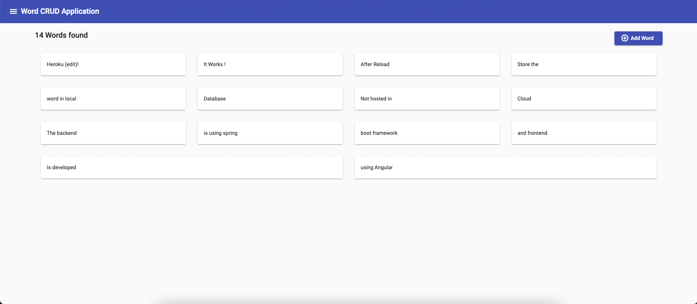
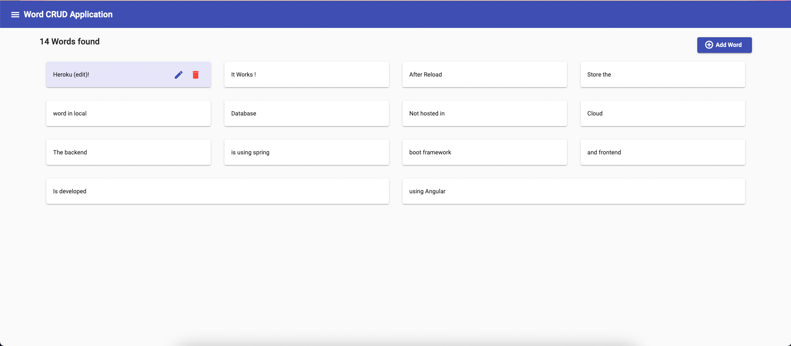
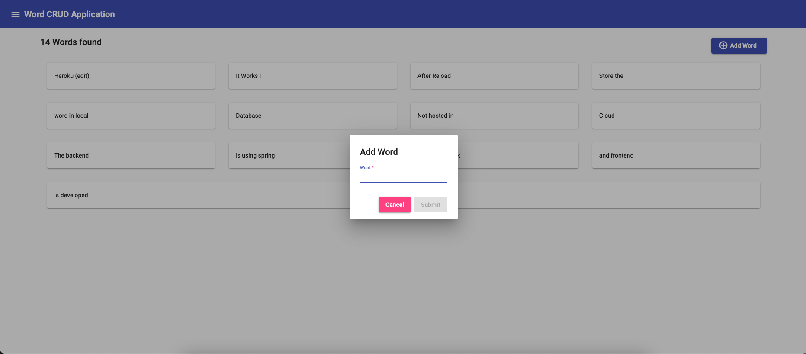
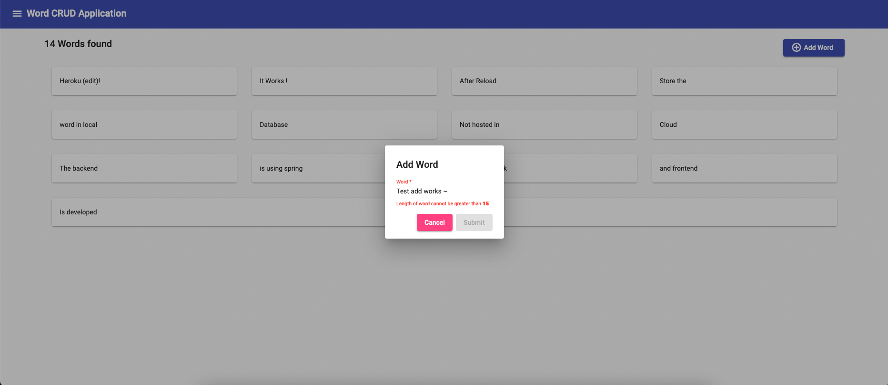
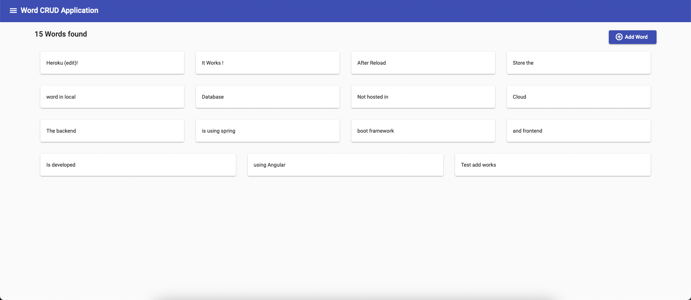
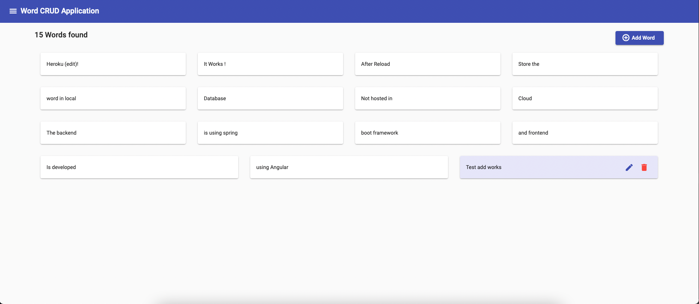
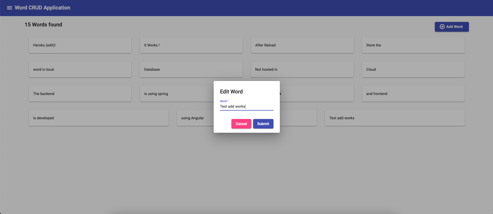

## App Info
Live Demo on Heroku: [Word CRUD Application](https://thawing-lake-61704.herokuapp.com)
Github Repo: [Word-Crud](https://github.com/kunalms/Word-Crud)

## Screenshots

Landing Page

User can hove on individual card for actions

Add button on top right lets user add a new word

Add Dialog has a validation of required and max length 15

User can also edit existing words 

Edit has same validations as add word dialog

